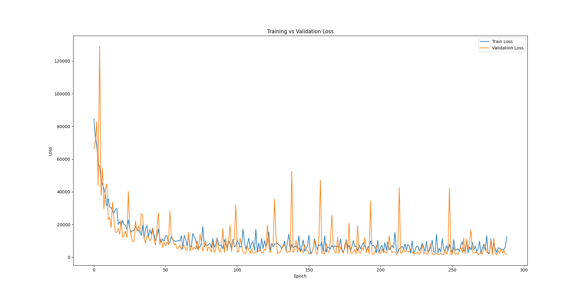
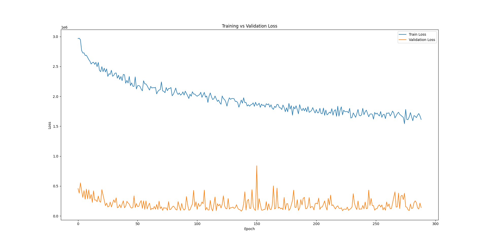
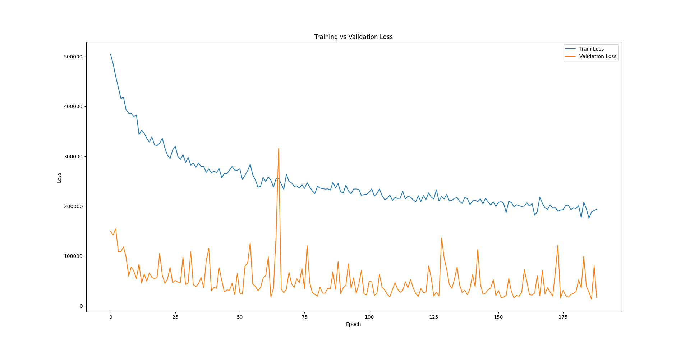
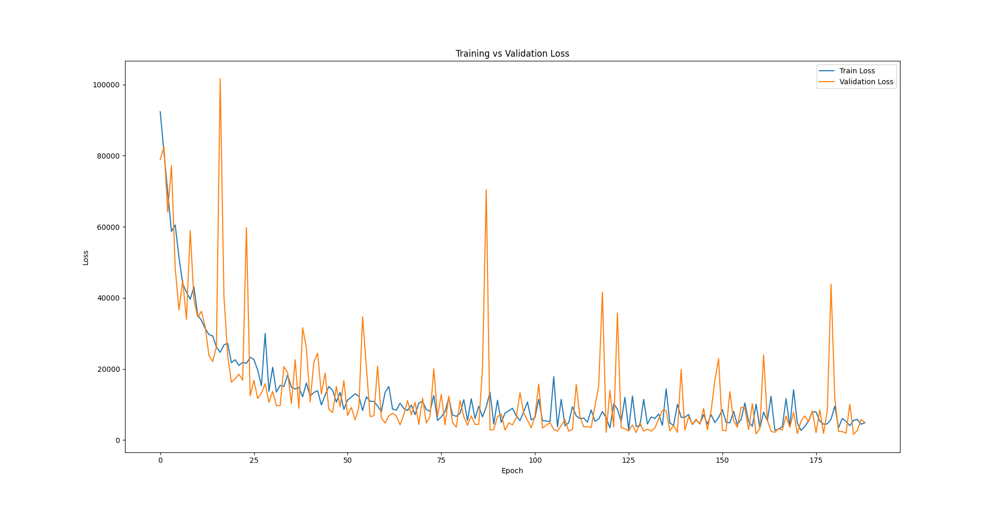

# Predviđanje cene polovnih automobila pomoću dubokog učenja

Ovaj projekat gradi model dubokog učenja za predviđanje cene polovnih automobila na osnovu osnovnih karakteristika automobila.

## Zahtevi

Instalacija zavisnosti:

```bash
python3 -m venv dl-env
source dl-env/bin/activate
pip install -r requirements.txt
```

## Kako trenirati

Iz **src** direktorijuma:

- Pripremite podatke:
  
  ```bash
  python3 prepare_data.py
  ```

- Trenira i validira model, iscrtava grafikon loss funkcije na osnovu trening i validacionih podataka, i na kraju testira na osnovu test podataka:
  
  ```bash
  python3 train_and_validate_model.py
  ```

Ovo će:
- Predobraditi i podeliti podatke
- Trenirati model koristeći neuronsku mrežu
- Sačuvati parametre modela, bias i scaler
- Testirati vaš model

## Pravljenje predviđanja

Da biste predvideli cenu nekog polovnog automobila:

```bash
python3 car_price_predictor.py
```

Od vas će biti zatraženo da unesete vrednosti za:
- Proizvođača, model i vrstu goriva preko padajuće liste
- Kilometražu, godište i zapreminu motora tekstualnim unosom

## Skup podataka

Izvor: [Car Sales Dataset](https://www.kaggle.com/datasets/msnbehdani/mock-dataset-of-second-hand-car-sales/)
- 50.000 zapisa o polovnim automobilima  
- Karakteristike uključuju proizvođača, model, vrstu goriva, kilometražu, godište, zapreminu motora i cenu.

## Trening modela

Za ovaj model korišćen je Adam optimizator sa korakom učenja od 0.001.
Neuronska mreža koju ću koristiti za trening modela izgleda ovako:
| Sloj | Tip sloja | Ulazi | Izlazi | Aktivacija | Dropout |
|------|------------|--------|----------|-------------|----------|
| 1 | Linear | `ulazna dimenzija` | 256 | ReLU | — |
| 2 | Linear | 256 | 128 | ReLU | — |
| 3 | Linear | 128 | 64 | ReLU | — |
| 4 | Linear | 64 | 1 | — | — |

Izgled grafikona Training vs Validation Loss za 300 epoha:



Rezutati testa:
| MAE | RMSE | R² |
|-----|------|----|
| 26.31 | 45.22 | 1.000 |

Rezultati testa su odlični, ali se na grafikonu može primetiti da često dolazi do overfitting-a, pa ću dodati dropout:
| Sloj | Tip sloja | Ulazi | Izlazi | Aktivacija | Dropout |
|------|------------|--------|----------|-------------|----------|
| 1 | Linear | `ulazna dimenzija` | 256 | ReLU | 0.3 |
| 2 | Linear | 256 | 128 | ReLU | 0.2 |
| 3 | Linear | 128 | 64 | ReLU | — |
| 4 | Linear | 64 | 1 | — | — |

Izgled grafikona Training vs Validation Loss za 300 epoha:



Rezutati testa:
| MAE | RMSE | R² |
|-----|------|----|
| 259.31 | 366.40 | 1.000 |

Rezultati testa su sada dosta lošiji, ali se primećuje da vrednosti dosta manje variraju. Takođe, kada su se u slučaju bez dropout-a dešavali skokovi, loss nije bio veći od loss-a u ovom slučaju. Sada ću smanjiti dropout zbog boljih rezultata, a takođe smanjiću i broj epoha, jer se u oba grafa primećuje su male promene posle 200. epohe:
| Sloj | Tip sloja | Ulazi | Izlazi | Aktivacija | Dropout |
|------|------------|--------|----------|-------------|----------|
| 1 | Linear | `ulazna dimenzija` | 256 | ReLU | 0.05 |
| 2 | Linear | 256 | 128 | ReLU | 0.01 |
| 3 | Linear | 128 | 64 | ReLU | — |
| 4 | Linear | 64 | 1 | — | — |

Izgled grafikona Training vs Validation Loss za 200 epoha:



Rezutati testa:
| MAE | RMSE | R² |
|-----|------|----|
| 82.37 | 127.52 | 1.000 |

**Zaključak**: Primećuje se da su skokovi u slučaju bez dropout-a dolazili do vrednosti od oko 60.000 MSELoss i dropout nije uspeo to da popravi, već je samo pogoršao rezultate. Konačni model koji će koristiti program `car_price_predictor.py` treniraću bez dropout-a, sa 200 epoha:



Rezutati testa:
| MAE | RMSE | R² |
|-----|------|----|
| 38.46 | 74.61 | 1.000 |

## Poređenje

Za poređenje ću iskoristiti rešenje korisnika [Shmagi Bokuchava](https://www.kaggle.com/code/shmagibokuchava7/pricepredict-pro) na sajtu [Kaggle](https://www.kaggle.com/). Ovde nije upotrebljeno duboko učenje, već razni modeli mašinskog učenja i rezultati su sledeći:

| Model | MAE | RMSE | R² |
|-------|-----|------|----|
| Random_forest | 513.751 | 978.166 | 0.996 |
| XGBoost | 250.968 | 422.298 | 0.999 |
| LightGBM | 292.209 | 475.699 | 0.999 |
| Super_Model | 203.175 | 344.671 | 1.000 |

Direktno poređenje sa najboljim modelom:

| Model | MAE | RMSE | R² |
|-------|-----|------|----|
| Moj DL model | 38.46 | 74.61 | 1.000 |
| Super_Model | 203.175 | 344.671 | 1.000 |

Ispostavlja se da se može upotrebiti duboko učenje i na ovom, iz ugla dubokog učenja, manjem skupu podataka.
